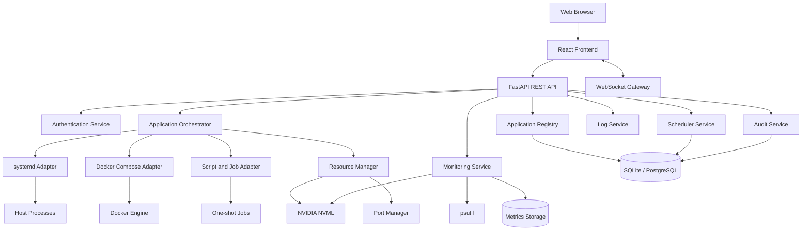
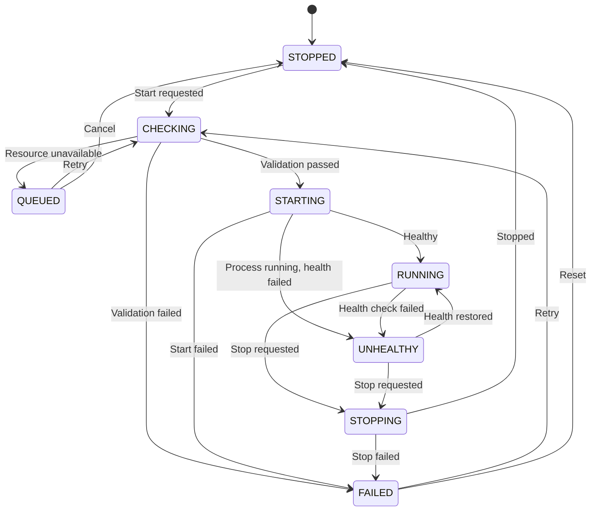
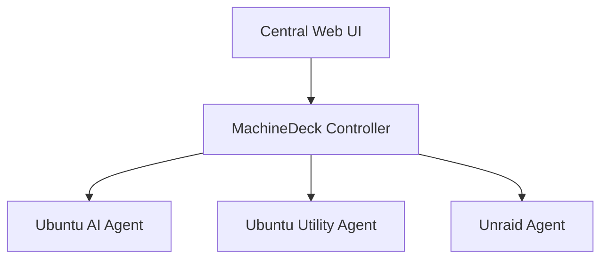

# MachineDeck 开发设计文档

> **项目名称：** MachineDeck  
> **项目类型：** Ubuntu 本地应用与 AI 工作负载管理平台  
> **文档状态：** Draft  
> **版本：** 0.1.0  
> **目标平台：** Ubuntu Linux  
> **主要运行环境：** Python venv、Docker Compose、Shell Script、NVIDIA GPU  
> **默认部署模式：** 单机、自托管、局域网访问

---

## 1. 项目概述

MachineDeck 是一个面向个人服务器、AI 工作站和家庭实验室环境的本地 Web 管理平台。

该平台用于统一管理运行在 Ubuntu 主机上的以下工作负载：

- Python virtual environment 应用；
- Docker Compose 项目；
- 普通可执行程序；
- Shell Script；
- 一次性批处理任务；
- 定时任务；
- 依赖 NVIDIA GPU 的 AI 应用。

MachineDeck 通过统一的 Web 界面提供应用注册、启动、停止、重启、日志查看、端口发现、健康检查、资源监控、任务调度和 GPU 冲突管理等能力。

项目的核心目标不是替代 Docker、systemd 或 Linux，而是在这些底层能力之上提供一个面向应用的统一控制层。

---

## 2. 背景与问题定义

当前 Ubuntu 主机上存在多个通过不同方式运行的应用，例如：

- 需要进入特定目录并激活 venv 后运行的 Python 应用；
- 需要执行 `docker compose up -d` 的 Docker 项目；
- 需要运行特定 `.sh` 脚本的服务；
- 需要手动查找启动端口的 Web 应用；
- 需要在任务结束后手动停止的临时服务；
- 可能同时争用 GPU 显存的 AI 应用。

目前的管理方式存在以下问题：

1. **启动方式分散**

   每个应用的工作目录、启动命令、环境变量和参数不同，用户需要手动记忆或查找。

2. **停止方式不统一**

   Docker、Python 进程和 Shell Script 的停止方式不同，部分应用还会创建子进程，容易出现残留进程。

3. **端口信息不透明**

   应用启动后，用户可能不知道其实际监听端口，或者端口已经被其他应用占用。

4. **缺少统一状态**

   无法在一个页面中确认哪些应用正在运行、是否健康、运行了多久，以及因为什么失败。

5. **缺少资源协调**

   多个 AI 应用可能同时加载模型，导致 GPU 显存不足、CUDA OOM 或系统资源耗尽。

6. **缺少调度能力**

   部分任务需要在指定时间运行、定期运行，或者等待 GPU 资源空闲后再执行。

7. **缺少集中日志**

   应用日志分散在终端、Docker logs、文件和 systemd journal 中，不方便排查问题。

8. **操作安全性不足**

   直接通过 Web 页面执行任意 Shell 命令会带来严重的主机安全风险。

---

## 3. 项目目标

### 3.1 核心目标

MachineDeck 应实现以下核心能力：

- 统一管理 Python venv、Docker Compose 和脚本型应用；
- 通过 Web 页面启动、停止、重启和查看应用状态；
- 自动发现或展示应用端口；
- 提供应用日志实时查看能力；
- 展示 CPU、RAM、GPU、VRAM、磁盘和网络使用情况；
- 在启动前检测端口冲突、资源不足和应用冲突；
- 支持定时启动、停止和执行一次性任务；
- 为 GPU 应用提供基础资源预留和排队机制；
- 保留应用执行历史和管理操作审计记录；
- 避免向前端暴露任意 Shell 执行能力。

### 3.2 次要目标

- 自动发现主机上的候选应用；
- 支持应用配置模板；
- 支持应用分组和标签；
- 支持多台 Ubuntu 主机；
- 支持通知和告警；
- 支持 Prometheus 或 Grafana 集成；
- 支持基于角色的多用户权限。

---

## 4. 非目标

第一阶段不计划实现以下能力：

- Kubernetes 兼容；
- 完整容器编排平台；
- 公有云部署平台；
- 面向第三方用户的 SaaS；
- 任意远程终端；
- 任意 Shell 命令执行；
- 对 GPU 显存进行硬件级隔离；
- 对所有未知应用进行零配置自动识别；
- 替代 Portainer、Cockpit、Grafana 或 systemd 的全部功能。

---

## 5. 设计原则

### 5.1 应用优先

系统管理的基本单位是“应用”，而不是单个进程或单个容器。

一个应用可以对应：

- 一个 systemd service；
- 一个 Docker Compose project；
- 一个一次性任务；
- 一个 Shell Script；
- 多个相关容器；
- 一个由主进程和子进程构成的进程组。

### 5.2 声明式配置

每个应用应通过受控的 manifest 文件或数据库配置进行定义。

前端只能对已注册的应用执行有限操作，不能提交任意命令。

### 5.3 使用成熟的底层能力

- Python 和普通进程优先使用 systemd 管理；
- Docker 应用使用 Docker Engine API 或 Docker Compose CLI；
- 系统指标使用 psutil；
- NVIDIA GPU 指标使用 NVML；
- 定时任务使用 APScheduler，关键任务可使用 systemd timer；
- 实时数据使用 WebSocket 或 Server-Sent Events。

### 5.4 最小权限

MachineDeck 后端应使用独立 Linux 用户运行，并仅获得管理指定应用所需的权限。

### 5.5 可恢复性

MachineDeck 后端重启后，必须能够重新识别应用实际状态，不应依赖后端内存中的临时状态。

### 5.6 可观测性

每次启动、停止、失败和调度执行都应可追踪，并记录：

- 操作时间；
- 操作来源；
- 应用 ID；
- 执行结果；
- 错误原因；
- 资源分配；
- 退出码。

---

## 6. 用户角色

### 6.1 Administrator

首个版本只支持一个管理员角色。

管理员可以：

- 查看系统状态；
- 添加、修改和删除应用；
- 启动、停止和重启应用；
- 创建和删除定时任务；
- 查看日志；
- 修改资源策略；
- 查看执行历史；
- 查看审计日志；
- 修改系统设置。

### 6.2 Viewer

Viewer 角色可作为后续功能。

Viewer 只能：

- 查看应用状态；
- 查看资源监控；
- 查看日志；
- 查看调度任务；
- 不能执行任何修改操作。

---

## 7. 总体架构



---

## 8. 技术栈

### 8.1 后端

- Python 3.12+
- FastAPI
- Uvicorn
- Pydantic
- SQLAlchemy
- Alembic
- SQLite
- APScheduler
- psutil
- `nvidia-ml-py`
- Docker SDK for Python
- `dbus-next` 或受控的 `systemctl`
- WebSocket
- PyYAML
- structlog 或标准 logging

### 8.2 前端

- React
- TypeScript
- Vite
- Tailwind CSS
- shadcn/ui
- TanStack Query
- Zustand
- Recharts 或 Apache ECharts
- xterm.js，可选

### 8.3 基础设施

- systemd
- Docker Engine
- Docker Compose v2
- NVIDIA Driver
- SQLite
- Nginx 或 Caddy，可选
- Tailscale、WireGuard 或 Cloudflare Access，可选

---

## 9. 部署模型

### 9.1 推荐部署方式

MachineDeck 后端直接运行在 Ubuntu 主机上，并由 systemd 管理。

```text
Ubuntu Host
├── MachineDeck-backend.service
├── MachineDeck-frontend
├── MachineDeck-managed-*.service
├── Docker Engine
├── NVIDIA Driver
└── Application Directories
```

### 9.2 不推荐将后端放入 Docker

MachineDeck 后端需要访问：

- systemd；
- Docker daemon；
- 主机进程；
- 主机端口；
- NVIDIA GPU；
- 应用目录；
- systemd journal。

如果后端运行在 Docker 中，则需要挂载 Docker socket、D-Bus、主机目录和设备文件，会显著增加权限和部署复杂度。

### 9.3 网络监听

默认：

```text
127.0.0.1:8080
```

局域网模式：

```text
0.0.0.0:8080
```

默认不允许直接暴露到公网。

---

## 10. 应用类型

### 10.1 Process Application

用于：

- Python venv；
- Node.js；
- Java；
- 二进制可执行程序；
- 长期运行的 Shell Script。

推荐由 systemd 管理。

### 10.2 Docker Compose Application

用于一个或多个由 Compose 定义的服务。

### 10.3 One-shot Job

用于：

- Whisper 批量转录；
- 数据处理；
- 模型转换；
- 定时备份；
- 文件清理；
- 只运行一次的 Shell Script。

### 10.4 External Application

用于只进行监控、不由 MachineDeck 启动的现有服务。

例如：

- 已经由其他 systemd unit 管理的服务；
- NAS 服务；
- 路由器管理页面；
- 外部服务器应用。

---

## 11. 应用 Manifest 规范

建议使用 YAML 作为应用定义格式。

### 11.1 Process Application 示例

```yaml
version: 1

id: comfyui
name: ComfyUI
description: Stable Diffusion workflow server
category: ai-image
icon: image
enabled: true

runtime:
  type: process
  working_dir: /home/justin/disk/project/ComfyUI
  command:
    - /home/justin/disk/project/ComfyUI/.venv/bin/python
    - main.py
    - --listen
    - 0.0.0.0
    - --port
    - "8188"

environment:
  PYTHONUNBUFFERED: "1"
  CUDA_VISIBLE_DEVICES: "${ALLOCATED_GPU}"

ports:
  - id: web
    name: Web UI
    protocol: http
    host: 8188
    health_path: /

resources:
  cpu:
    recommended_cores: 4
  memory:
    recommended_mb: 12000
  gpu:
    required: true
    candidates: [0, 1]
    allocation: exclusive
    minimum_free_vram_mb: 18000
    expected_vram_mb: 22000

startup:
  timeout_seconds: 120
  health_check_interval_seconds: 3

shutdown:
  signal: SIGTERM
  timeout_seconds: 30

restart_policy:
  mode: on-failure
  maximum_retries: 3

conflicts:
  applications:
    - whisperx-large
    - model-training
  groups:
    - gpu-heavy

tags:
  - gpu
  - web-ui
  - image-generation
```

### 11.2 Docker Compose 示例

```yaml
version: 1

id: immich
name: Immich
description: Self-hosted photo management
category: media
enabled: true

runtime:
  type: compose
  working_dir: /home/justin/docker/immich
  compose_file: docker-compose.yml
  project_name: immich
  env_file: .env

compose:
  services: []
  remove_on_stop: false
  build_on_deploy: false
  pull_before_start: false

ports:
  auto_discover: true
  preferred:
    - service: immich-server
      container_port: 2283
      protocol: http

resources:
  gpu:
    required: false

startup:
  timeout_seconds: 180
  health_url: http://127.0.0.1:2283
```

### 11.3 One-shot Job 示例

```yaml
version: 1

id: whisper-batch
name: Whisper Batch Transcription
category: ai-audio
enabled: true

runtime:
  type: job
  working_dir: /home/justin/disk/project/Whisper
  command:
    - /home/justin/disk/project/Whisper/whisperx-env/bin/python
    - transcribe.py
    - --input
    - "${INPUT_PATH}"
    - --output
    - "${OUTPUT_PATH}"

parameters:
  - id: INPUT_PATH
    type: path
    required: true
  - id: OUTPUT_PATH
    type: path
    required: true

resources:
  gpu:
    required: true
    candidates: [0, 1]
    allocation: exclusive
    minimum_free_vram_mb: 12000
    expected_vram_mb: 14000

execution:
  timeout_seconds: 14400
  retain_logs_days: 30
```

---

## 12. 应用状态模型

### 12.1 状态定义

| 状态 | 含义 |
|---|---|
| `STOPPED` | 应用已停止 |
| `QUEUED` | 等待资源或等待调度 |
| `CHECKING` | 正在进行端口、资源和配置检查 |
| `STARTING` | 已发出启动命令，等待运行或健康检查 |
| `RUNNING` | 应用正在运行且状态正常 |
| `UNHEALTHY` | 进程仍在运行，但健康检查失败 |
| `STOPPING` | 正在停止 |
| `FAILED` | 启动、停止或运行失败 |
| `UNKNOWN` | 无法确认实际状态 |
| `DISABLED` | 应用被禁用 |

### 12.2 状态转换



---

## 13. 应用启动流程

### 13.1 标准启动流程

1. 接收启动请求；
2. 验证用户权限；
3. 读取应用配置；
4. 确认应用未被禁用；
5. 获取应用级互斥锁；
6. 获取资源调度锁；
7. 验证工作目录和可执行文件；
8. 验证环境变量；
9. 检查端口冲突；
10. 检查应用冲突规则；
11. 检查 CPU、RAM、磁盘和 GPU 条件；
12. 选择 GPU；
13. 创建资源 reservation；
14. 生成最终运行环境；
15. 调用对应 runtime adapter；
16. 等待进程或容器进入运行状态；
17. 执行健康检查；
18. 更新应用状态；
19. 写入执行历史；
20. 写入审计日志；
21. 释放调度锁。

### 13.2 启动失败处理

启动失败时必须：

- 保存错误信息；
- 保存退出码；
- 保存标准错误输出；
- 释放 GPU reservation；
- 更新应用状态为 `FAILED`；
- 记录审计事件；
- 根据重试策略决定是否重试；
- 向前端返回可理解的错误原因。

---

## 14. Process Runtime 设计

### 14.1 venv 处理方式

不需要在 Shell 中执行：

```bash
source .venv/bin/activate
```

应直接使用 venv 中的解释器：

```bash
/path/to/.venv/bin/python app.py
```

### 14.2 systemd Unit

每个长期运行的 Process Application 对应一个受 MachineDeck 管理的 systemd unit。

示例：

```ini
[Unit]
Description=MachineDeck Managed Service - ComfyUI
After=network-online.target
Wants=network-online.target

[Service]
Type=simple
User=justin
WorkingDirectory=/home/justin/disk/project/ComfyUI
ExecStart=/home/justin/disk/project/ComfyUI/.venv/bin/python main.py --listen 0.0.0.0 --port 8188
Environment=PYTHONUNBUFFERED=1
Environment=CUDA_VISIBLE_DEVICES=0
Restart=on-failure
RestartSec=5
KillMode=control-group
TimeoutStartSec=120
TimeoutStopSec=30

[Install]
WantedBy=multi-user.target
```

### 14.3 Unit 生成方式

MachineDeck 可以采用以下两种策略：

#### 策略 A：动态生成 Unit

根据 manifest 生成：

```text
/etc/systemd/system/MachineDeck-<app-id>.service
```

优点：

- 配置清晰；
- 可被系统管理员直接查看；
- 重启后可恢复。

缺点：

- 需要受控 sudo 权限；
- 修改配置后需要 `daemon-reload`。

#### 策略 B：systemd transient unit

通过 D-Bus 创建 transient unit。

优点：

- 不需要长期写入大量 unit 文件；
- 适合一次性任务。

缺点：

- 实现复杂；
- 排查难度更高。

第一版建议长期服务使用策略 A，一次性任务使用 transient unit 或 subprocess。

### 14.4 停止策略

停止时应调用 systemd，而不是只杀主 PID。

```bash
systemctl stop MachineDeck-comfyui.service
```

必须使用：

```ini
KillMode=control-group
```

以确保主进程和所有子进程被统一停止。

---

## 15. Docker Compose Runtime 设计

### 15.1 支持动作

| 动作 | 实际行为 |
|---|---|
| Start | `docker compose up -d` 或 `docker compose start` |
| Stop | `docker compose stop` |
| Restart | `docker compose restart` |
| Redeploy | `docker compose up -d --build` |
| Pull and Redeploy | `docker compose pull` 后执行 `up -d` |
| Remove | `docker compose down` |
| Remove with Volumes | `docker compose down -v`，默认禁用 |

### 15.2 Stop 与 Down 的区别

默认“停止”应使用：

```bash
docker compose stop
```

不应默认使用：

```bash
docker compose down
```

`down` 会移除容器和网络，属于更具破坏性的操作。

### 15.3 状态读取

优先使用：

```bash
docker compose ps --format json
```

或者 Docker Engine API 获取：

- 服务名称；
- 容器 ID；
- 容器状态；
- 健康状态；
- 端口；
- 启动时间；
- 重启次数；
- 资源用量。

### 15.4 Docker 事件

后端应订阅 Docker events，以便及时响应：

- container start；
- container stop；
- container die；
- health status；
- container destroy；
- image pull。

---

## 16. 端口管理

### 16.1 端口来源

端口信息按以下优先级获取：

1. Manifest 明确声明；
2. Docker Compose 端口映射；
3. Docker Engine API；
4. systemd service 进程及其子进程的监听端口；
5. `psutil.net_connections()`；
6. `ss -ltnp`；
7. 日志正则匹配；
8. 用户手动配置。

### 16.2 端口数据结构

```json
{
  "id": "web",
  "name": "Web UI",
  "protocol": "http",
  "bind_address": "0.0.0.0",
  "host_port": 8188,
  "container_port": null,
  "url": "http://192.168.1.50:8188",
  "source": "manifest",
  "status": "listening"
}
```

### 16.3 启动前端口检查

启动前检查：

- 端口是否已监听；
- 占用该端口的 PID；
- PID 是否属于 MachineDeck 已注册应用；
- 是否允许自动切换端口；
- 是否可以停止冲突应用；
- 是否应中止启动。

### 16.4 端口冲突响应

```json
{
  "error": "PORT_CONFLICT",
  "port": 8188,
  "process_id": 18452,
  "process_name": "python",
  "application_id": "legacy-comfyui",
  "suggested_actions": [
    "stop_conflicting_application",
    "select_another_port",
    "cancel"
  ]
}
```

---

## 17. GPU 与显存管理

### 17.1 目标

GPU 调度功能用于降低以下风险：

- 多个模型同时加载；
- CUDA out of memory；
- 同一张 GPU 被多个重型应用占用；
- 应用启动后立即崩溃；
- 用户不知道哪个进程占用显存。

### 17.2 GPU 指标

使用 NVML 获取：

- GPU 型号；
- GPU index；
- UUID；
- 总显存；
- 已用显存；
- 空闲显存；
- GPU 利用率；
- 显存控制器利用率；
- 温度；
- 功率；
- 风扇；
- 运行进程；
- 每个进程使用的显存。

### 17.3 GPU 分配模式

#### Exclusive

同一时间只允许一个 Exclusive 应用占用目标 GPU。

适用于：

- 大模型推理；
- 模型训练；
- ComfyUI 重型工作流；
- 大型 Whisper 批处理。

#### Shared

允许多个应用共享 GPU，但根据预计显存进行软预留。

#### Any

应用不限制 GPU，由启动命令自行决定。

#### None

应用不使用 GPU。

### 17.4 Reservation 数据

```json
{
  "id": "reservation-uuid",
  "application_id": "comfyui",
  "instance_id": "instance-uuid",
  "gpu_index": 0,
  "mode": "exclusive",
  "expected_vram_mb": 22000,
  "created_at": "2026-07-20T12:00:00-07:00",
  "expires_at": null,
  "status": "active"
}
```

### 17.5 GPU 选择算法

推荐第一版采用以下算法：

1. 获取 GPU 调度锁；
2. 读取应用允许使用的 GPU；
3. 排除存在 Exclusive reservation 的 GPU；
4. 查询每张 GPU 的实际空闲显存；
5. 减去 MachineDeck 已分配但尚未实际占用的 reservation；
6. 检查 `minimum_free_vram_mb`；
7. 按可用显存从高到低排序；
8. 选择第一张满足要求的 GPU；
9. 创建 reservation；
10. 设置 `CUDA_VISIBLE_DEVICES`；
11. 启动应用；
12. 启动失败时释放 reservation。

### 17.6 Queue 策略

资源不足时可配置：

```yaml
resource_policy:
  on_unavailable: queue
  maximum_wait_seconds: 7200
  retry_interval_seconds: 30
```

可选策略：

- `fail`：立即失败；
- `queue`：进入队列；
- `prompt`：等待用户决定；
- `stop_conflict`：停止指定冲突应用后继续；
- `force`：忽略检查并启动。

### 17.7 软限制说明

GPU reservation 只能作为软调度机制。

MachineDeck 无法保证应用不会超过声明的显存使用量，因此需要：

- 实时监控实际显存；
- 显存超限告警；
- CUDA OOM 日志识别；
- 可选的自动停止策略；
- 默认不自动杀死应用。

---

## 18. 系统资源监控

### 18.1 主机级指标

- CPU 总利用率；
- 每核心 CPU 利用率；
- Load Average；
- RAM 使用量；
- Swap 使用量；
- 磁盘容量；
- 磁盘读写；
- 网络上传和下载；
- 系统运行时间；
- 主机温度；
- Docker daemon 状态；
- NVIDIA Driver 状态。

### 18.2 应用级指标

- CPU 使用率；
- RAM 使用量；
- 进程数；
- 线程数；
- 磁盘读写；
- 网络流量；
- GPU index；
- GPU 使用率；
- VRAM 使用量；
- 运行时间；
- 重启次数。

### 18.3 采样频率

建议：

| 指标类型 | 采样频率 |
|---|---|
| 页面实时数据 | 2 秒 |
| 应用状态 | 2–5 秒或事件驱动 |
| 历史指标 | 60 秒 |
| 健康检查 | 5–30 秒 |
| GPU 队列重试 | 30 秒 |

### 18.4 历史保留

第一版：

- 1 分钟粒度；
- 保留 7 天；
- 超过 7 天自动删除；
- 后续可增加降采样。

---

## 19. 健康检查

### 19.1 支持类型

- Process running；
- Docker healthcheck；
- HTTP GET；
- TCP connect；
- Command；
- Log pattern；
- File exists；
- Custom plugin，后续支持。

### 19.2 HTTP 健康检查示例

```yaml
health_check:
  type: http
  url: http://127.0.0.1:8188/
  interval_seconds: 10
  timeout_seconds: 3
  healthy_status_codes: [200, 204, 302]
  failure_threshold: 3
  success_threshold: 1
```

### 19.3 健康状态

进程正在运行不等于应用健康。

例如：

- Python 进程存在，但模型加载失败；
- 容器正在运行，但依赖数据库不可用；
- 端口存在，但接口返回 500；
- Web UI 启动，但 GPU 初始化失败。

因此必须区分：

```text
RUNNING
UNHEALTHY
FAILED
```

---

## 20. 日志系统

### 20.1 日志来源

| Runtime | 日志来源 |
|---|---|
| Process | systemd journal |
| Compose | Docker logs |
| Job | stdout、stderr、执行记录 |
| MachineDeck | Python application logs |

### 20.2 日志能力

- 实时跟随；
- 查看最近 100、500、5000 行；
- 按时间范围查询；
- 搜索；
- 区分 stdout 和 stderr；
- 下载；
- 复制；
- 暂停自动滚动；
- 错误高亮；
- 执行记录关联。

### 20.3 错误识别

第一版可内置以下常见错误模式：

- `CUDA out of memory`
- `Address already in use`
- `ModuleNotFoundError`
- `No module named`
- `No space left on device`
- `Permission denied`
- `Connection refused`
- `Container is unhealthy`
- `NVIDIA driver not available`
- `Killed`
- `Segmentation fault`

### 20.4 日志保留

- MachineDeck 不应默认复制并永久保存所有 Docker 或 journal 日志；
- 执行历史中保存关键摘要；
- 一次性任务日志可按配置保留；
- 提供全局日志保留策略。

---

## 21. 调度系统

### 21.1 调度类型

- 指定时间执行一次；
- 固定间隔；
- Cron 表达式；
- 每日启动；
- 每日停止；
- 资源可用后执行；
- 依赖其他任务完成后执行；
- 手动加入队列。

### 21.2 调度动作

- Start Application；
- Stop Application；
- Restart Application；
- Run Job；
- Redeploy Compose；
- Pull and Redeploy；
- Execute Maintenance Task。

### 21.3 调度策略

```yaml
schedule_policy:
  if_already_running: skip
  if_resource_unavailable: queue
  maximum_wait_minutes: 120
  retry_count: 2
  retry_delay_seconds: 60
  timeout_seconds: 14400
```

### 21.4 执行状态

| 状态 | 含义 |
|---|---|
| `SCHEDULED` | 已计划 |
| `QUEUED` | 等待运行 |
| `RUNNING` | 正在执行 |
| `SUCCEEDED` | 成功 |
| `FAILED` | 失败 |
| `SKIPPED` | 根据策略跳过 |
| `CANCELLED` | 被取消 |
| `TIMED_OUT` | 超时 |

### 21.5 APScheduler 与 systemd timer

普通任务使用 APScheduler。

以下任务建议支持 systemd timer：

- 后端故障时仍必须执行的任务；
- 系统启动前后任务；
- 关键备份；
- 主机级维护任务。

---

## 22. 数据模型

### 22.1 applications

| 字段 | 类型 | 说明 |
|---|---|---|
| id | string | 应用唯一 ID |
| name | string | 显示名称 |
| description | text | 描述 |
| runtime_type | enum | process、compose、job、external |
| config_yaml | text | 完整配置 |
| enabled | boolean | 是否启用 |
| created_at | datetime | 创建时间 |
| updated_at | datetime | 更新时间 |

### 22.2 application_instances

| 字段 | 类型 | 说明 |
|---|---|---|
| id | UUID | 实例 ID |
| application_id | string | 应用 ID |
| status | enum | 当前状态 |
| runtime_identifier | string | systemd unit、container 或 PID |
| started_at | datetime | 启动时间 |
| stopped_at | datetime | 停止时间 |
| exit_code | integer | 退出码 |
| error_message | text | 错误 |
| allocated_gpu | integer | 分配 GPU |
| metadata_json | JSON | 附加信息 |

### 22.3 schedules

| 字段 | 类型 | 说明 |
|---|---|---|
| id | UUID | 调度 ID |
| application_id | string | 应用 |
| action | enum | start、stop、restart、run |
| trigger_type | enum | date、interval、cron、resource |
| trigger_config | JSON | 触发配置 |
| enabled | boolean | 是否启用 |
| next_run_at | datetime | 下一次执行 |
| created_at | datetime | 创建时间 |

### 22.4 executions

| 字段 | 类型 | 说明 |
|---|---|---|
| id | UUID | 执行 ID |
| application_id | string | 应用 |
| schedule_id | UUID | 可选 |
| action | string | 执行动作 |
| status | enum | 执行状态 |
| requested_by | string | 用户或系统 |
| requested_at | datetime | 请求时间 |
| started_at | datetime | 开始时间 |
| finished_at | datetime | 完成时间 |
| exit_code | integer | 退出码 |
| error_code | string | 标准错误码 |
| error_message | text | 错误说明 |
| log_reference | string | 日志引用 |

### 22.5 gpu_reservations

| 字段 | 类型 | 说明 |
|---|---|---|
| id | UUID | Reservation ID |
| application_id | string | 应用 |
| instance_id | UUID | 实例 |
| gpu_index | integer | GPU |
| mode | enum | exclusive、shared |
| expected_vram_mb | integer | 预计显存 |
| status | enum | pending、active、released |
| created_at | datetime | 创建时间 |
| released_at | datetime | 释放时间 |

### 22.6 audit_events

| 字段 | 类型 | 说明 |
|---|---|---|
| id | UUID | 事件 ID |
| actor | string | 操作者 |
| action | string | 操作 |
| target_type | string | 目标类型 |
| target_id | string | 目标 ID |
| result | string | 结果 |
| details_json | JSON | 详情 |
| created_at | datetime | 时间 |

### 22.7 metrics_samples

| 字段 | 类型 | 说明 |
|---|---|---|
| id | integer | 主键 |
| scope_type | enum | host、application、gpu |
| scope_id | string | 范围 ID |
| timestamp | datetime | 采样时间 |
| metrics_json | JSON | 指标 |

---

## 23. API 设计

### 23.1 Applications

```http
GET    /api/v1/applications
POST   /api/v1/applications
GET    /api/v1/applications/{application_id}
PUT    /api/v1/applications/{application_id}
DELETE /api/v1/applications/{application_id}
POST   /api/v1/applications/{application_id}/validate
POST   /api/v1/applications/{application_id}/start
POST   /api/v1/applications/{application_id}/stop
POST   /api/v1/applications/{application_id}/restart
POST   /api/v1/applications/{application_id}/redeploy
GET    /api/v1/applications/{application_id}/status
GET    /api/v1/applications/{application_id}/ports
GET    /api/v1/applications/{application_id}/metrics
GET    /api/v1/applications/{application_id}/logs
```

### 23.2 Jobs

```http
POST   /api/v1/jobs/{application_id}/run
GET    /api/v1/jobs/executions
GET    /api/v1/jobs/executions/{execution_id}
POST   /api/v1/jobs/executions/{execution_id}/cancel
GET    /api/v1/jobs/executions/{execution_id}/logs
```

### 23.3 Schedules

```http
GET    /api/v1/schedules
POST   /api/v1/schedules
GET    /api/v1/schedules/{schedule_id}
PUT    /api/v1/schedules/{schedule_id}
DELETE /api/v1/schedules/{schedule_id}
POST   /api/v1/schedules/{schedule_id}/enable
POST   /api/v1/schedules/{schedule_id}/disable
POST   /api/v1/schedules/{schedule_id}/run-now
```

### 23.4 System

```http
GET    /api/v1/system/overview
GET    /api/v1/system/cpu
GET    /api/v1/system/memory
GET    /api/v1/system/disks
GET    /api/v1/system/network
GET    /api/v1/system/gpus
GET    /api/v1/system/processes
GET    /api/v1/system/health
```

### 23.5 GPU

```http
GET    /api/v1/gpus
GET    /api/v1/gpus/{gpu_index}
GET    /api/v1/gpus/{gpu_index}/processes
GET    /api/v1/gpu-reservations
GET    /api/v1/gpu-queue
POST   /api/v1/gpu-queue/{queue_id}/cancel
POST   /api/v1/gpu-queue/{queue_id}/force
```

### 23.6 Audit

```http
GET    /api/v1/audit-events
GET    /api/v1/executions
GET    /api/v1/executions/{execution_id}
```

### 23.7 WebSocket

```text
/ws/system-metrics
/ws/application-events
/ws/applications/{application_id}/logs
/ws/applications/{application_id}/metrics
/ws/gpu-events
```

---

## 24. 前端页面

### 24.1 Dashboard

显示：

- 主机状态；
- CPU、RAM、磁盘；
- GPU 卡片；
- 正在运行的应用；
- 排队中的应用；
- 最近失败；
- 即将执行的任务；
- 系统告警。

### 24.2 Applications

字段：

- 名称；
- Runtime；
- 状态；
- 端口；
- CPU；
- RAM；
- GPU；
- VRAM；
- Uptime；
- 操作。

筛选：

- All；
- Running；
- Stopped；
- Failed；
- Docker；
- Process；
- Job；
- GPU；
- Favorites。

### 24.3 Application Detail

页面区域：

- 应用概览；
- Start、Stop、Restart；
- Open Web UI；
- 当前状态；
- 资源使用；
- GPU 分配；
- 端口；
- 健康检查；
- 实时日志；
- 配置；
- 环境变量；
- 定时任务；
- 执行历史；
- 审计记录。

### 24.4 GPU Manager

显示：

- 每张 GPU 的型号；
- 总显存；
- 已用显存；
- 空闲显存；
- 温度；
- 功率；
- 利用率；
- GPU 进程；
- Reservation；
- Queue；
- 冲突应用。

### 24.5 Schedules

提供：

- 列表视图；
- 日历视图；
- 下一次执行；
- 最近执行结果；
- 启用和禁用；
- 立即执行。

### 24.6 Executions

提供：

- 执行状态；
- 开始和结束时间；
- 触发来源；
- 退出码；
- 错误；
- 日志；
- 重试。

### 24.7 System

显示：

- 系统版本；
- Kernel；
- CPU；
- RAM；
- Swap；
- 磁盘；
- 网络；
- Docker；
- NVIDIA Driver；
- MachineDeck 版本；
- 数据库状态；
- 后端日志。

### 24.8 Settings

配置：

- 主机名称；
- 监听地址；
- 认证；
- 日志保留；
- 指标保留；
- GPU 策略；
- 默认超时；
- 允许目录；
- 通知；
- 备份。

---

## 25. 安全设计

### 25.1 禁止任意命令执行

前端不能提交任意 Shell 命令。

禁止如下 API：

```http
POST /api/run-shell
```

禁止请求体：

```json
{
  "command": "任意命令"
}
```

所有命令必须由已验证的应用 manifest 生成。

### 25.2 命令执行规则

- 使用参数数组；
- 默认不使用 `shell=True`；
- 验证 executable 路径；
- 验证 working directory；
- 限制可访问目录；
- 环境变量使用允许列表；
- 对用户输入参数进行类型校验；
- 禁止命令替换；
- 禁止重定向；
- 禁止管道；
- 禁止任意 sudo。

### 25.3 独立 Linux 用户

建议创建：

```text
MachineDeck
```

该用户只获得必要权限。

### 25.4 sudoers

只允许执行明确命令，例如：

```sudoers
MachineDeck ALL=(root) NOPASSWD: /bin/systemctl start MachineDeck-*.service
MachineDeck ALL=(root) NOPASSWD: /bin/systemctl stop MachineDeck-*.service
MachineDeck ALL=(root) NOPASSWD: /bin/systemctl restart MachineDeck-*.service
MachineDeck ALL=(root) NOPASSWD: /bin/systemctl status MachineDeck-*.service
MachineDeck ALL=(root) NOPASSWD: /bin/systemctl daemon-reload
```

实际实现时应进一步确认 sudoers 通配符行为，并尽可能使用专用 helper，避免过宽授权。

### 25.5 Docker 权限

能够访问 Docker socket 的用户通常拥有接近 root 的主机权限。

因此：

- MachineDeck 管理员账户必须受到保护；
- 不得将 MachineDeck 直接暴露到公网；
- Docker 操作必须写入审计日志；
- 删除 volume 等破坏性操作必须二次确认；
- 默认隐藏危险操作。

### 25.6 身份认证

第一版：

- 单管理员账号；
- 密码使用 Argon2id；
- Session Cookie；
- HttpOnly；
- SameSite；
- CSRF 防护；
- 登录失败限速；
- 自动锁定；
- 可选 TOTP。

### 25.7 Secret 管理

- `.env` 默认不返回前端；
- Secret 值默认遮罩；
- 日志中对 token、password、key 进行脱敏；
- 配置导出默认不包含 Secret；
- 后续可支持系统 keyring 或加密存储。

### 25.8 远程访问

推荐：

- Tailscale；
- WireGuard；
- Cloudflare Access；
- 反向代理加 TLS。

不推荐直接将 MachineDeck 端口映射到公网。

---

## 26. 配置验证

应用保存前需要验证：

- `id` 格式；
- ID 唯一；
- 工作目录存在；
- Compose 文件存在；
- Python 或 executable 存在；
- 命令参数合法；
- 端口范围合法；
- 环境变量名称合法；
- GPU index 存在；
- 显存配置合理；
- 健康检查地址合法；
- 定时表达式合法；
- 路径位于允许目录内；
- 冲突应用存在；
- 引用模板存在。

支持 Dry Run：

```http
POST /api/v1/applications/{id}/validate
```

返回：

```json
{
  "valid": false,
  "errors": [
    {
      "field": "runtime.command[0]",
      "code": "FILE_NOT_FOUND",
      "message": "Python executable does not exist."
    }
  ],
  "warnings": [
    {
      "field": "resources.gpu.expected_vram_mb",
      "code": "VRAM_ESTIMATE_HIGH",
      "message": "Expected VRAM is close to the total memory of GPU 0."
    }
  ]
}
```

---

## 27. 自动发现

### 27.1 扫描目标

后续可扫描：

- `compose.yaml`；
- `compose.yml`；
- `docker-compose.yml`；
- `docker-compose.yaml`；
- `pyvenv.cfg`；
- `.venv/bin/python`；
- `venv/bin/python`；
- `requirements.txt`；
- `pyproject.toml`；
- `package.json`；
- `start.sh`；
- `run.sh`；
- 常见 Web 框架入口文件。

### 27.2 自动发现原则

扫描结果只能作为候选应用。

系统不得自动执行推测出来的命令。

候选应用必须由管理员确认：

- 应用名称；
- 工作目录；
- Runtime；
- 启动命令；
- 端口；
- GPU 策略；
- 健康检查。

---

## 28. 通知与告警

后续支持：

- Web Notification；
- Email；
- Telegram；
- Discord；
- Slack；
- Webhook。

告警类型：

- 应用启动失败；
- 应用异常退出；
- Docker container unhealthy；
- GPU 显存不足；
- GPU 温度过高；
- 磁盘空间不足；
- 定时任务失败；
- 应用长时间排队；
- MachineDeck 后端异常；
- Docker daemon 不可用。

---

## 29. 错误码规范

建议使用结构化错误码：

| 错误码 | 含义 |
|---|---|
| `APP_NOT_FOUND` | 应用不存在 |
| `APP_DISABLED` | 应用已禁用 |
| `APP_ALREADY_RUNNING` | 应用已经运行 |
| `APP_NOT_RUNNING` | 应用未运行 |
| `CONFIG_INVALID` | 配置无效 |
| `WORKING_DIR_NOT_FOUND` | 工作目录不存在 |
| `EXECUTABLE_NOT_FOUND` | 可执行文件不存在 |
| `PORT_CONFLICT` | 端口冲突 |
| `GPU_UNAVAILABLE` | GPU 不可用 |
| `VRAM_INSUFFICIENT` | 显存不足 |
| `APPLICATION_CONFLICT` | 应用冲突 |
| `START_TIMEOUT` | 启动超时 |
| `STOP_TIMEOUT` | 停止超时 |
| `HEALTH_CHECK_FAILED` | 健康检查失败 |
| `DOCKER_UNAVAILABLE` | Docker 不可用 |
| `SYSTEMD_ERROR` | systemd 操作失败 |
| `PERMISSION_DENIED` | 权限不足 |
| `JOB_TIMEOUT` | 任务超时 |
| `SCHEDULE_INVALID` | 调度配置错误 |

---

## 30. 项目目录

```text
MachineDeck/
├── backend/
│   ├── app/
│   │   ├── api/
│   │   │   ├── applications.py
│   │   │   ├── executions.py
│   │   │   ├── schedules.py
│   │   │   ├── system.py
│   │   │   └── websocket.py
│   │   ├── adapters/
│   │   │   ├── base.py
│   │   │   ├── systemd_adapter.py
│   │   │   ├── compose_adapter.py
│   │   │   └── job_adapter.py
│   │   ├── orchestration/
│   │   │   ├── application_manager.py
│   │   │   ├── state_machine.py
│   │   │   ├── resource_manager.py
│   │   │   ├── gpu_manager.py
│   │   │   ├── port_manager.py
│   │   │   └── queue_manager.py
│   │   ├── monitoring/
│   │   │   ├── host_metrics.py
│   │   │   ├── process_metrics.py
│   │   │   ├── docker_metrics.py
│   │   │   └── gpu_metrics.py
│   │   ├── scheduler/
│   │   │   ├── scheduler_service.py
│   │   │   └── triggers.py
│   │   ├── logging/
│   │   │   ├── journal_reader.py
│   │   │   ├── docker_log_reader.py
│   │   │   └── error_classifier.py
│   │   ├── security/
│   │   │   ├── auth.py
│   │   │   ├── permissions.py
│   │   │   ├── validation.py
│   │   │   └── redaction.py
│   │   ├── database/
│   │   │   ├── models.py
│   │   │   ├── session.py
│   │   │   └── migrations/
│   │   ├── schemas/
│   │   ├── services/
│   │   ├── config.py
│   │   └── main.py
│   ├── tests/
│   │   ├── unit/
│   │   ├── integration/
│   │   └── fixtures/
│   ├── alembic.ini
│   └── pyproject.toml
├── frontend/
│   ├── src/
│   │   ├── api/
│   │   ├── components/
│   │   ├── features/
│   │   ├── hooks/
│   │   ├── pages/
│   │   ├── stores/
│   │   └── types/
│   ├── package.json
│   └── vite.config.ts
├── manifests/
│   ├── examples/
│   └── schemas/
├── systemd/
│   ├── MachineDeck-backend.service
│   └── templates/
├── scripts/
│   ├── install.sh
│   ├── uninstall.sh
│   └── MachineDeckctl
├── docs/
│   ├── architecture.md
│   ├── manifest-spec.md
│   ├── security.md
│   └── api.md
├── .github/
│   └── workflows/
├── README.md
└── LICENSE
```

---

## 31. 开发阶段

## Phase 0：技术验证

### 目标

验证关键底层能力。

### 任务

- 使用 Python 读取 CPU、RAM 和磁盘；
- 使用 NVML 读取 GPU 和进程显存；
- 使用 Docker SDK 读取容器和端口；
- 使用 systemd 启动和停止测试服务；
- 读取 journal；
- 使用 WebSocket 推送实时指标；
- 验证 Ubuntu 权限方案。

### 验收标准

- 能在脚本中启动和停止一个 systemd 测试服务；
- 能启动和停止一个 Compose 项目；
- 能获取两张 GPU 的显存；
- 能识别监听端口；
- 能读取实时日志。

---

## Phase 1：MVP

### 范围

- 单用户管理员；
- 手动创建应用；
- Process Application；
- Docker Compose Application；
- Start、Stop、Restart；
- 应用状态；
- 日志；
- 手动端口配置；
- CPU、RAM、GPU、VRAM 和磁盘监控；
- SQLite；
- 基础审计日志。

### 验收标准

1. 用户可以在 Web 页面添加一个 venv 应用；
2. 用户可以启动、停止和重启该应用；
3. 应用停止时不残留子进程；
4. 用户可以添加一个 Compose 项目；
5. 用户可以启动、停止和重启 Compose 项目；
6. 用户可以查看应用日志；
7. 用户可以通过页面打开应用 Web UI；
8. Dashboard 可显示系统和 GPU 使用量；
9. 后端重启后可以重新识别应用状态；
10. 所有修改操作均写入审计日志。

---

## Phase 2：自动化与可靠性

### 范围

- 自动端口发现；
- HTTP 和 TCP 健康检查；
- 定时任务；
- 执行历史；
- 应用配置编辑；
- Docker events；
- systemd 状态事件；
- 错误分类；
- 通知。

### 验收标准

- Docker 端口可自动读取；
- Process 应用监听端口可被识别；
- 应用健康状态与进程状态分离；
- 定时启动和停止准确执行；
- 失败任务可查看原因和日志；
- 应用异常退出可触发通知。

---

## Phase 3：GPU 调度

### 范围

- GPU reservation；
- Exclusive 和 Shared 模式；
- 自动 GPU 选择；
- 显存不足排队；
- 冲突应用；
- 冲突组；
- `CUDA_VISIBLE_DEVICES` 注入；
- GPU 进程归属；
- OOM 错误识别。

### 验收标准

- 应用可以指定允许使用的 GPU；
- 系统能够选择空闲显存较多的 GPU；
- Exclusive 应用不会被同时分配到同一 GPU；
- 显存不足的任务可以进入队列；
- 应用停止后 reservation 会释放；
- 启动失败时 reservation 不会残留；
- 页面可显示 GPU 占用来源。

---

## Phase 4：自动发现与体验优化

### 范围

- 扫描 Compose 项目；
- 扫描 venv；
- 候选应用；
- 应用模板；
- 图标；
- 收藏；
- 分组；
- 标签；
- 批量操作；
- 配置导入和导出。

---

## Phase 5：多主机

### 架构



### 范围

- Agent 注册；
- 心跳；
- 主机标签；
- 远程应用管理；
- 跨主机调度；
- 主机级权限；
- TLS 和 Agent token；
- 中央执行历史。

---

## 32. 测试策略

### 32.1 单元测试

覆盖：

- Manifest validation；
- 状态机；
- GPU 选择算法；
- Reservation；
- 端口冲突；
- 调度策略；
- 错误分类；
- 权限规则。

### 32.2 集成测试

覆盖：

- systemd；
- Docker Compose；
- journal；
- Docker logs；
- SQLite；
- APScheduler；
- WebSocket；
- NVML mock。

### 32.3 端到端测试

场景：

1. 添加 Process 应用；
2. 启动；
3. 等待健康；
4. 查看端口；
5. 查看日志；
6. 停止；
7. 验证无残留进程。

场景：

1. 添加 Compose 应用；
2. 启动；
3. 查看多个容器；
4. 查看端口；
5. Restart；
6. Stop；
7. 验证容器状态。

场景：

1. 启动 GPU Exclusive 应用；
2. 启动第二个冲突应用；
3. 第二个应用进入队列；
4. 停止第一个应用；
5. 第二个应用自动启动。

### 32.4 安全测试

- 任意命令注入；
- 路径穿越；
- 环境变量注入；
- 非授权 API；
- CSRF；
- Session fixation；
- Secret 泄露；
- Docker 危险操作；
- sudo 权限越界。

---

## 33. 性能目标

第一版目标：

| 项目 | 目标 |
|---|---|
| 应用列表响应 | 小于 500 ms |
| Start API 初始响应 | 小于 1 秒 |
| 实时指标延迟 | 小于 3 秒 |
| 日志延迟 | 小于 2 秒 |
| 支持注册应用数 | 至少 100 |
| 同时运行应用数 | 至少 30 |
| 同时 WebSocket 客户端 | 至少 10 |
| 后端空闲 RAM | 小于 500 MB |
| 后端空闲 CPU | 小于 2% |

启动过程本身的耗时不计入 API 初始响应目标，实际启动状态通过事件更新。

---

## 34. 备份与恢复

需要备份：

- SQLite 数据库；
- Manifest；
- MachineDeck 配置；
- 用户配置；
- 加密后的 Secret；
- 生成的 systemd unit；
- 调度配置。

建议提供：

```bash
MachineDeckctl backup
MachineDeckctl restore <backup-file>
```

备份默认不包含应用自身数据和 Docker volume。

---

## 35. 升级策略

- 使用语义化版本；
- 数据库使用 Alembic migration；
- Manifest 使用 `version` 字段；
- API 使用 `/api/v1`；
- 升级前自动备份数据库；
- 破坏性升级必须明确提示；
- 支持回滚上一个版本。

---

## 36. 第一版功能清单

### 必须实现

- [ ] 管理员登录；
- [ ] 应用列表；
- [ ] 应用详情；
- [ ] Process Application；
- [ ] Docker Compose Application；
- [ ] Start；
- [ ] Stop；
- [ ] Restart；
- [ ] 应用状态；
- [ ] 实时日志；
- [ ] 手动端口配置；
- [ ] Open Web UI；
- [ ] CPU 监控；
- [ ] RAM 监控；
- [ ] 磁盘监控；
- [ ] GPU 监控；
- [ ] VRAM 监控；
- [ ] SQLite；
- [ ] 审计日志；
- [ ] 配置验证；
- [ ] systemd 部署脚本。

### 建议实现

- [ ] 自动 Docker 端口发现；
- [ ] HTTP 健康检查；
- [ ] 简单定时任务；
- [ ] 执行历史；
- [ ] 常见错误识别；
- [ ] 应用标签；
- [ ] Dashboard 告警。

### 暂缓

- [ ] 多用户；
- [ ] 多主机；
- [ ] 自动应用发现；
- [ ] Prometheus；
- [ ] Grafana；
- [ ] 完整 GPU 队列；
- [ ] 插件系统；
- [ ] 移动端应用；
- [ ] 公网 SaaS。

---

## 37. MVP 推荐开发顺序

1. 建立后端项目；
2. 建立数据库和应用模型；
3. 定义 Manifest schema；
4. 实现 Runtime Adapter 抽象；
5. 实现 Process Adapter；
6. 实现 Compose Adapter；
7. 实现应用状态刷新；
8. 实现 Start、Stop、Restart API；
9. 实现日志读取；
10. 实现系统指标；
11. 实现 GPU 指标；
12. 建立前端 Dashboard；
13. 建立应用列表；
14. 建立应用详情；
15. 建立 WebSocket；
16. 增加认证；
17. 增加审计；
18. 编写安装脚本；
19. 编写测试；
20. 在真实应用上进行验证。

---

## 38. 首批测试应用

建议使用以下应用验证 MachineDeck：

### 非 GPU Process

- 简单 FastAPI 测试服务；
- 静态 HTTP Server；
- 一个持续输出日志的 Python 服务。

### GPU Process

- ComfyUI；
- WhisperX；
- IndexTTS；
- 本地大模型推理服务。

### Docker Compose

- Supabase；
- Immich；
- 一个简单的 Nginx + Redis Compose 项目。

### One-shot Job

- Whisper 文件转录；
- 日志清理；
- 数据库备份；
- 图片批量处理。

---

## 39. 关键技术决策

### 决策 1：Process 使用 systemd

**原因：**

- 可靠管理子进程；
- 支持系统重启；
- 标准日志；
- 状态可恢复；
- 崩溃重启；
- Linux 原生。

### 决策 2：后端运行在 Host

**原因：**

- 需要管理 systemd；
- 需要访问 Docker；
- 需要监控主机进程；
- 需要读取 GPU；
- 避免容器挂载过多高权限接口。

### 决策 3：第一版使用 SQLite

**原因：**

- 单机部署；
- 安装简单；
- 运维成本低；
- 足够支持 MVP；
- 后续可迁移 PostgreSQL。

### 决策 4：GPU 管理使用软调度

**原因：**

- 消费级 GPU 无法进行完整显存隔离；
- 应用实际显存使用不可完全预测；
- 通过 reservation、检测和队列可解决大部分个人服务器场景。

### 决策 5：禁止通用 Web Shell

**原因：**

- 后端具有高主机权限；
- 任意命令执行风险不可接受；
- 应用 manifest 已能覆盖目标使用场景。

---

## 40. 成功标准

当以下场景全部成立时，MachineDeck 第一阶段可视为成功：

1. 用户不再需要手动进入多个项目目录；
2. 用户不再需要手动激活 venv；
3. 用户不再需要手动执行 Compose 命令；
4. 用户可在一个页面看到所有应用状态；
5. 用户可直接打开应用 Web 页面；
6. 用户可统一查看日志；
7. 用户可看到主机和 GPU 资源；
8. 用户能在启动前发现端口冲突；
9. 应用停止后不会残留大量子进程；
10. 后端重启后不会丢失应用实际状态；
11. 所有关键操作可审计；
12. 系统不向前端开放任意 Shell 执行能力。

---

## 41. 后续扩展方向

- 多主机 Agent；
- GPU 作业优先级；
- 任务依赖图；
- 模型文件管理；
- 自动卸载空闲模型；
- Wake-on-LAN；
- 主机关机和重启；
- 应用版本更新；
- Git pull 和自动部署；
- Docker image 更新检测；
- 应用模板市场；
- 移动端 PWA；
- Home Assistant 集成；
- Telegram Bot；
- 模型推理请求队列；
- AI 应用成本和使用统计；
- 与现有 Portainer、Cockpit、Grafana 集成。

---

## 42. 总结

MachineDeck 的本质是一个面向单机 Ubuntu AI 工作站的应用控制平面。

它将以下能力整合在统一界面中：

- systemd 的进程管理；
- Docker Compose 的容器管理；
- psutil 的系统监控；
- NVML 的 GPU 监控；
- APScheduler 的定时执行；
- 端口检测；
- 健康检查；
- 日志查看；
- GPU 资源协调；
- 审计和安全控制。

第一版应优先确保以下三部分稳定：

1. Runtime Adapter；
2. Application State Machine；
3. Resource and Conflict Validation。

在这三部分可靠后，再逐步增加自动发现、智能 GPU 调度、多主机和通知能力。

该开发路线可以在不引入 Kubernetes 等复杂平台的前提下，显著降低个人 AI 主机和家庭实验室中多个应用的日常管理成本。
