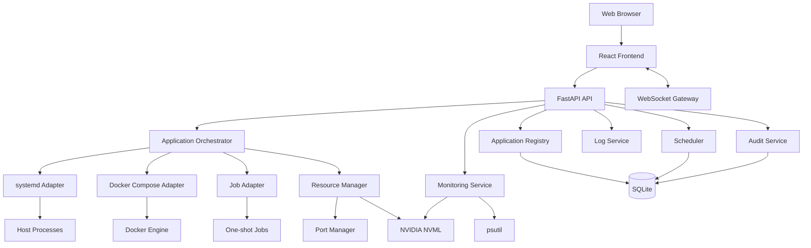
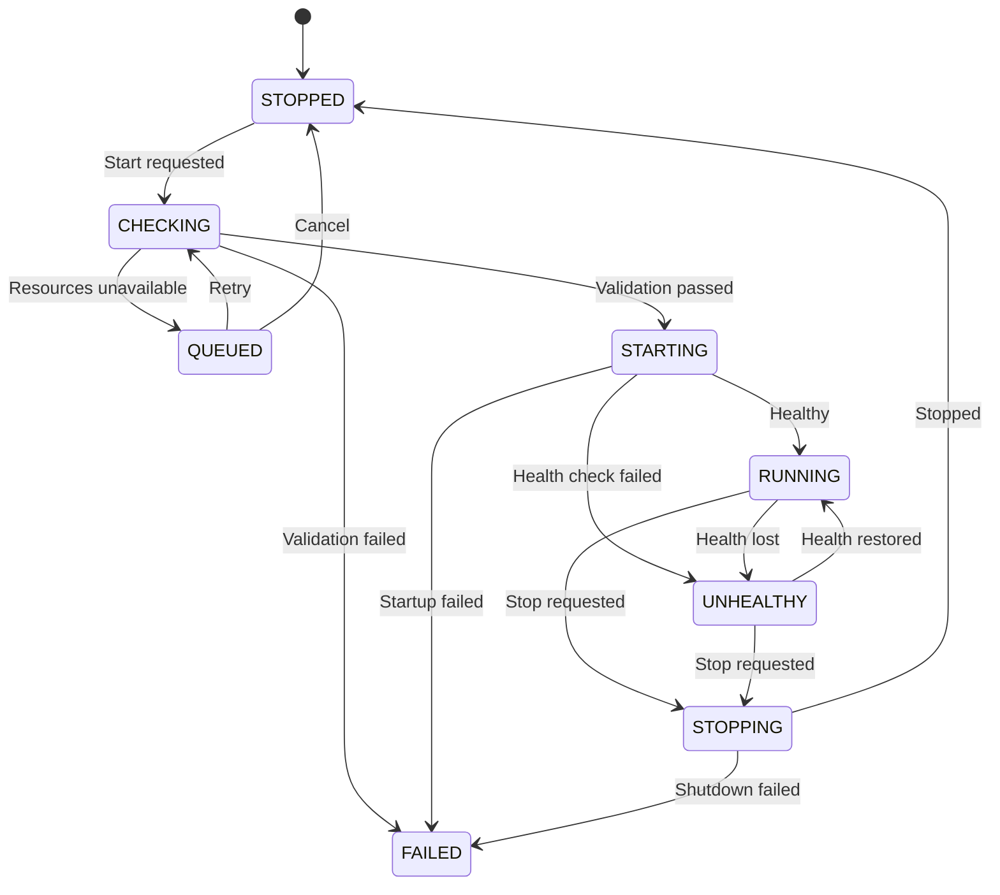

# MachineDeck

> **A local-first control plane for processes, containers, jobs, and GPUs.**

## Development Status

**Phase 0 — Technical Validation: Complete**

**Phase 1 — MVP: In progress**

Validated capabilities include:

- CPU, RAM, disk, listening-port, and NVIDIA GPU metrics;
- host-side PyNVML access to an NVIDIA GeForce RTX 3090 with 24 GiB VRAM;
- allowlisted user-level systemd lifecycle operations and journal access;
- Docker Compose lifecycle and published-port discovery;
- live WebSocket metric updates;
- a trusted application registry with systemd-user and Compose adapters;
- rejection of unregistered applications, unsafe unit names, path traversal,
  arbitrary commands, and lifecycle request arguments;
- graceful degradation when Docker, NVML, or systemd is unavailable.

Phase 0 uses user-level systemd without sudo or root privileges. See
[`docs/phase-0.md`](docs/phase-0.md) for the validation record and
[`docs/security-milestone.md`](docs/security-milestone.md) for the future
system-wide service design.

MachineDeck is a self-hosted web application for managing workloads on an Ubuntu machine from a single dashboard.

It brings Python virtual environments, systemd services, Docker Compose stacks, scheduled jobs, ports, logs, and system resources into one unified interface. MachineDeck is especially useful for local AI workstations and home lab servers where multiple applications compete for CPU, memory, GPU, VRAM, and network ports.

Instead of manually entering project directories, activating virtual environments, running shell scripts, checking ports, and stopping processes, MachineDeck provides a consistent application model and a secure control layer on top of existing Linux tools.

---

## Why MachineDeck?

A typical local workstation may run applications in several different ways:

```bash
source .venv/bin/activate
python app.py
```

```bash
docker compose up -d
```

```bash
./start.sh
```

```bash
systemctl start my-service
```

Each application may also have its own:

- working directory;
- environment variables;
- startup arguments;
- listening ports;
- shutdown behavior;
- log location;
- health checks;
- GPU requirements;
- scheduling rules.

MachineDeck unifies these workloads under a single application-oriented dashboard.

---

## Core Features

### Unified Application Management

Manage different workload types from one interface:

- Python virtual environment applications;
- systemd services;
- Docker Compose stacks;
- shell scripts;
- one-shot jobs;
- scheduled tasks;
- externally managed services.

Each registered application can expose a standard set of actions:

- Start;
- Stop;
- Restart;
- Redeploy;
- Run;
- Open Web UI;
- View logs;
- View resource usage.

### Docker Compose Management

MachineDeck can manage existing Compose projects without forcing them into a proprietary format.

Planned capabilities include:

- start, stop, restart, and redeploy;
- service and container status;
- health information;
- automatic port discovery;
- Docker log streaming;
- image update detection;
- Docker event monitoring.

### Process and Virtual Environment Management

Python virtual environments are executed directly through their own interpreter:

```bash
/path/to/project/.venv/bin/python app.py
```

Long-running host processes are managed through systemd, which provides:

- reliable process supervision;
- child process cleanup;
- restart policies;
- journal logging;
- startup recovery;
- accurate runtime state.

### Port Discovery and Conflict Detection

MachineDeck can collect ports from:

- application manifests;
- Docker Compose port mappings;
- the Docker Engine API;
- listening host processes;
- systemd process groups;
- application logs.

Before starting an application, MachineDeck can detect whether a required port is already in use and identify the conflicting process or registered application.

### System Monitoring

The dashboard can display:

- CPU utilization;
- per-core utilization;
- RAM and swap usage;
- disk usage and I/O;
- network activity;
- host uptime;
- application-level process usage;
- Docker container usage.

### GPU and VRAM Monitoring

MachineDeck is designed with local AI workstations in mind.

Using NVIDIA NVML, it can display:

- GPU model;
- GPU utilization;
- total, used, and free VRAM;
- temperature;
- power usage;
- fan speed;
- GPU processes;
- per-process VRAM usage.

### GPU-Aware Scheduling

Planned GPU scheduling features include:

- preferred GPU selection;
- automatic GPU selection;
- minimum free VRAM checks;
- expected VRAM reservations;
- exclusive and shared allocation modes;
- application conflict groups;
- resource queues;
- `CUDA_VISIBLE_DEVICES` injection;
- release of reservations after shutdown;
- CUDA out-of-memory detection.

MachineDeck uses soft scheduling. It can coordinate applications based on declared resource requirements, but it does not provide hardware-level VRAM isolation.

### Scheduled Jobs

MachineDeck can schedule application actions such as:

- start at a specific time;
- stop at a specific time;
- restart on a recurring schedule;
- run a one-shot processing job;
- wait until GPU resources become available;
- execute maintenance tasks.

Standard scheduling can be implemented with APScheduler, while critical host-level tasks may use systemd timers.

### Logs and Execution History

MachineDeck provides a unified logging experience across:

- systemd journal;
- Docker logs;
- stdout and stderr from one-shot jobs;
- MachineDeck internal logs.

Execution records can include:

- requested action;
- requesting user or scheduler;
- start and finish time;
- exit code;
- allocated GPU;
- error category;
- log reference;
- final status.

### Health Checks

Supported or planned health check types include:

- process state;
- Docker health status;
- HTTP request;
- TCP connection;
- command execution;
- log pattern;
- file existence.

This allows MachineDeck to distinguish between an application that is merely running and one that is actually healthy.

---

## Example Use Cases

MachineDeck can manage applications such as:

- ComfyUI;
- WhisperX;
- IndexTTS;
- local LLM servers;
- Stable Diffusion services;
- Supabase;
- Immich;
- Minecraft servers;
- FastAPI applications;
- Node.js services;
- batch transcription jobs;
- backup and maintenance scripts.

Example dashboard:

```text
MachineDeck
├── ComfyUI              Running     GPU 0    18.4 GB VRAM    :8188
├── WhisperX Batch       Queued      GPU 1    Waiting for 12 GB
├── IndexTTS             Stopped
├── Supabase             Running              8 containers
├── Immich               Healthy              :2283
└── Backup Job           Scheduled             02:00 daily
```

---

## Architecture



---

## Technology Stack

### Backend

- Python 3.12+
- FastAPI
- Pydantic
- SQLAlchemy
- Alembic
- SQLite
- APScheduler
- psutil
- NVIDIA NVML
- Docker SDK for Python
- systemd D-Bus or controlled `systemctl` integration
- WebSocket

### Frontend

- React
- TypeScript
- Vite
- Tailwind CSS
- shadcn/ui
- TanStack Query
- Zustand
- Recharts or Apache ECharts

### Host Integration

- systemd
- Docker Engine
- Docker Compose v2
- NVIDIA Driver
- Linux process and networking APIs

---

## Application Manifest

Applications are defined through declarative YAML manifests.

### Process Application

```yaml
version: 1

id: comfyui
name: ComfyUI
description: Stable Diffusion workflow server
category: ai-image
enabled: true

runtime:
  type: process
  working_dir: /home/user/apps/ComfyUI
  command:
    - /home/user/apps/ComfyUI/.venv/bin/python
    - main.py
    - --listen
    - 0.0.0.0
    - --port
    - "8188"

environment:
  PYTHONUNBUFFERED: "1"
  CUDA_VISIBLE_DEVICES: "${ALLOCATED_GPU}"

ports:
  - id: web
    name: Web UI
    protocol: http
    host: 8188
    health_path: /

resources:
  memory:
    recommended_mb: 12000
  gpu:
    required: true
    candidates: [0, 1]
    allocation: exclusive
    minimum_free_vram_mb: 18000
    expected_vram_mb: 22000

startup:
  timeout_seconds: 120

shutdown:
  signal: SIGTERM
  timeout_seconds: 30

restart_policy:
  mode: on-failure
  maximum_retries: 3

conflicts:
  groups:
    - gpu-heavy

tags:
  - gpu
  - web-ui
  - image-generation
```

### Docker Compose Application

```yaml
version: 1

id: immich
name: Immich
description: Self-hosted photo management
category: media
enabled: true

runtime:
  type: compose
  working_dir: /home/user/docker/immich
  compose_file: docker-compose.yml
  project_name: immich
  env_file: .env

compose:
  remove_on_stop: false
  build_on_deploy: false
  pull_before_start: false

ports:
  auto_discover: true
  preferred:
    - service: immich-server
      container_port: 2283
      protocol: http

startup:
  timeout_seconds: 180
  health_url: http://127.0.0.1:2283
```

### One-Shot Job

```yaml
version: 1

id: whisper-batch
name: Whisper Batch Transcription
category: ai-audio
enabled: true

runtime:
  type: job
  working_dir: /home/user/apps/Whisper
  command:
    - /home/user/apps/Whisper/.venv/bin/python
    - transcribe.py
    - --input
    - "${INPUT_PATH}"
    - --output
    - "${OUTPUT_PATH}"

parameters:
  - id: INPUT_PATH
    type: path
    required: true
  - id: OUTPUT_PATH
    type: path
    required: true

resources:
  gpu:
    required: true
    candidates: [0, 1]
    allocation: exclusive
    minimum_free_vram_mb: 12000
    expected_vram_mb: 14000

execution:
  timeout_seconds: 14400
  retain_logs_days: 30
```

---

## Application States

MachineDeck uses an explicit application state model:

| State | Description |
|---|---|
| `STOPPED` | The application is not running |
| `QUEUED` | Waiting for resources or scheduling |
| `CHECKING` | Validating configuration and resources |
| `STARTING` | Startup command issued |
| `RUNNING` | Running and healthy |
| `UNHEALTHY` | Running but failing health checks |
| `STOPPING` | Shutdown in progress |
| `FAILED` | Startup, runtime, or shutdown failure |
| `UNKNOWN` | Runtime state cannot be determined |
| `DISABLED` | Application is disabled |



---

## Security Model

MachineDeck controls high-privilege host capabilities and must be deployed carefully.

### No General-Purpose Web Shell

MachineDeck does not expose an endpoint for arbitrary shell commands.

Applications must be registered and validated before they can be executed.

Unsafe design:

```http
POST /api/run-shell
```

```json
{
  "command": "arbitrary shell command"
}
```

MachineDeck instead executes validated command arrays generated from application manifests.

### Least Privilege

Recommended deployment:

- run MachineDeck under a dedicated Linux user;
- restrict manageable directories;
- restrict systemd unit names;
- avoid unrestricted sudo access;
- validate executables and working directories;
- redact secrets from logs;
- audit every state-changing operation.

### Docker Socket Warning

Access to the Docker socket generally provides root-equivalent control over the host.

MachineDeck should therefore:

- require authentication;
- never be exposed directly to the public internet;
- protect destructive Docker operations;
- record all Docker actions;
- use Tailscale, WireGuard, or an authenticated reverse proxy for remote access.

### Secret Handling

- environment files are hidden by default;
- secrets are masked in the UI;
- logs are redacted;
- exported configuration excludes secrets unless explicitly requested;
- future versions may support encrypted secret storage.

---

## Recommended Deployment Model

MachineDeck should run directly on the Ubuntu host as a systemd service.

```text
Ubuntu Host
├── machinedeck.service
├── machinedeck-managed-*.service
├── Docker Engine
├── NVIDIA Driver
├── Application Directories
└── MachineDeck Data
```

Running the controller inside Docker is not recommended for the first release because it needs controlled access to:

- systemd;
- host processes;
- Docker;
- host ports;
- NVIDIA devices;
- journals;
- application directories.

---

## Planned Project Structure

```text
machinedeck/
├── backend/
│   ├── app/
│   │   ├── api/
│   │   ├── adapters/
│   │   ├── orchestration/
│   │   ├── monitoring/
│   │   ├── scheduler/
│   │   ├── logging/
│   │   ├── security/
│   │   ├── database/
│   │   ├── schemas/
│   │   └── main.py
│   ├── tests/
│   └── pyproject.toml
├── frontend/
│   ├── src/
│   └── package.json
├── manifests/
│   ├── examples/
│   └── schemas/
├── systemd/
├── scripts/
├── docs/
├── .github/
├── README.md
└── LICENSE
```

---

## Roadmap

### Phase 0 — Technical Validation

- [x] Read CPU, RAM, disk, and network metrics
- [x] Read NVIDIA GPU and VRAM metrics
- [x] Start and stop a test systemd service
- [x] Start and stop a Docker Compose stack
- [x] Stream journal logs
- [x] Stream Docker logs
- [x] Detect listening ports
- [x] Push metrics through WebSocket
- [x] Validate the Ubuntu permission model

### Phase 1 — MVP

- [ ] Single administrator account
- [x] Application registry
- [ ] Process applications
- [x] Docker Compose applications
- [x] Start, stop, and restart
- [x] Application state model
- [ ] Real-time logs
- [ ] Manual port configuration
- [ ] Open Web UI action
- [ ] CPU, RAM, disk, GPU, and VRAM dashboard
- [x] SQLite persistence
- [ ] Audit log
- [x] Configuration validation
- [ ] systemd installation

### Phase 2 — Automation and Reliability

- [ ] Automatic port discovery
- [ ] HTTP and TCP health checks
- [ ] Scheduled actions
- [ ] Execution history
- [ ] Docker event monitoring
- [ ] systemd state event monitoring
- [ ] Error classification
- [ ] Notifications
- [ ] Application configuration editor

### Phase 3 — GPU Scheduling

- [ ] GPU reservations
- [ ] Exclusive and shared allocation
- [ ] Automatic GPU selection
- [ ] Minimum free VRAM validation
- [ ] GPU resource queue
- [ ] Application conflict groups
- [ ] `CUDA_VISIBLE_DEVICES` injection
- [ ] GPU process ownership mapping
- [ ] CUDA OOM detection
- [ ] Reservation recovery after restart

### Phase 4 — Discovery and User Experience

- [ ] Scan for Compose projects
- [ ] Scan for Python virtual environments
- [ ] Candidate application review
- [ ] Application templates
- [ ] Categories and tags
- [ ] Favorites
- [ ] Bulk actions
- [ ] Configuration import and export
- [ ] PWA support

### Phase 5 — Multi-Host Management

- [ ] MachineDeck Agent
- [ ] Host registration
- [ ] Agent heartbeat
- [ ] Remote application management
- [ ] Cross-host scheduling
- [ ] Host labels
- [ ] TLS and agent authentication
- [ ] Centralized execution history

---

## MVP Success Criteria

The first release will be considered successful when:

1. users no longer need to manually enter multiple project directories;
2. users no longer need to activate virtual environments manually;
3. users can manage Compose stacks without using the terminal;
4. all registered applications are visible in one dashboard;
5. application ports and Web UIs are easy to open;
6. systemd and Docker logs are available in one interface;
7. CPU, memory, GPU, VRAM, and disk usage are visible;
8. port conflicts are detected before startup;
9. stopping a process application does not leave child processes behind;
10. backend restarts do not lose the real application state;
11. all important management actions are auditable;
12. the frontend cannot execute arbitrary shell commands.

---

## Development Status

MachineDeck is currently in the design and early development stage.

The initial implementation should focus on three stable foundations:

1. runtime adapters;
2. the application state machine;
3. resource and conflict validation.

Advanced automation, GPU queues, automatic discovery, and multi-host support should be built only after these foundations are reliable.

---

## Contributing

MachineDeck is intended to become an open-source project.

Contribution guidelines, development setup instructions, issue templates, and coding standards will be added as the implementation begins.

Areas where contributions will be especially valuable include:

- systemd integration;
- Docker Compose integration;
- NVIDIA GPU monitoring;
- Linux process and port discovery;
- frontend dashboard design;
- security review;
- application manifest validation;
- testing on different Ubuntu versions and GPU configurations.

---

## Project Philosophy

MachineDeck does not replace Linux, systemd, Docker, or existing monitoring tools.

It provides an application-oriented control layer above them.

The project follows four principles:

- **Local-first:** Your applications and operational data remain on your machine.
- **Declarative:** Applications are described through validated manifests.
- **Secure by default:** No unrestricted web shell or arbitrary command execution.
- **Runtime-neutral:** Processes, containers, and jobs are managed through one application model.

---

## License

Apache License 2.0.

---

## Name

**MachineDeck** combines two ideas:

- **Machine** — the entire Ubuntu host and its workloads;
- **Deck** — a unified command deck for monitoring and control.

> **Control every workload on your machine.**
